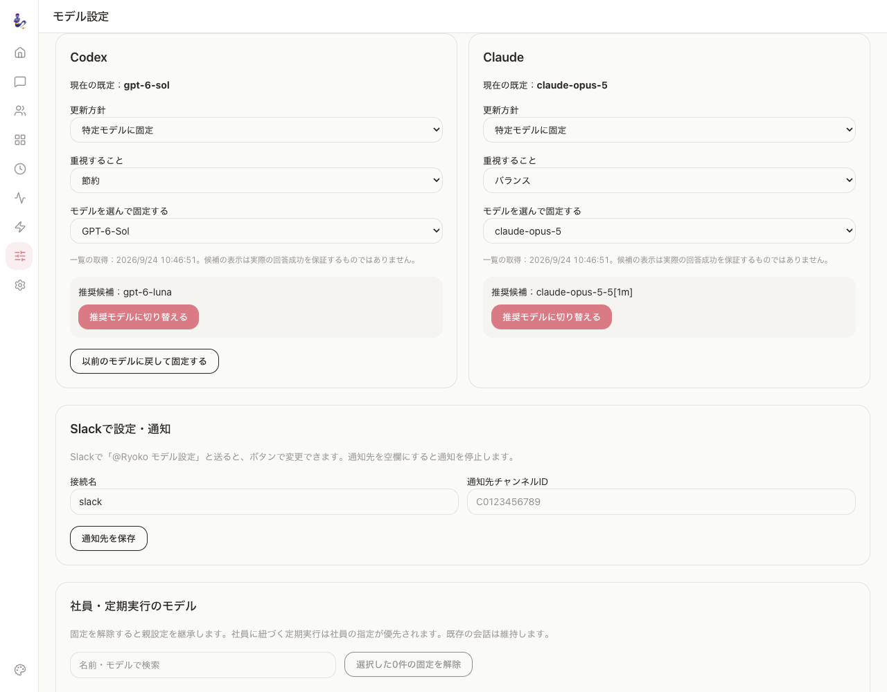

# 🌸 OpenRyoko

**Slackで会話し、Claude Code・Codex・Gemini CLIに仕事をつなぐ、常駐AIアシスタント。**

Slackで依頼し、Webダッシュボードで会話・社員・定期ジョブ・実行状況を管理できます。完了条件の追跡、必要な場面での返信やリアクション、モデルの選択と既定モデルの自動追従を備えています。

<p align="center">
  
</p>

[Jinn](https://github.com/hristo2612/jinn) のゲートウェイ・AI組織・Cron・Web UIを基盤に、日本語とSlackでの運用を中心に開発しています。MITライセンスで利用できます。

CLIを使う個人・小規模チーム向けのガイドです。初回は「始め方」と「モデル設定」を読み、以降は必要な章を参照してください。

[始め方](#まずwebで動かしてslackを接続する) · [モデル設定](#モデルを選ぶ既定モデルを追従させる) · [最近の機能](#最近の機能でできること) · [更新方法](#本体cliコンテナを更新する) · [変更履歴](CHANGELOG.md)

## まずWebで動かして、Slackを接続する

Node.js 22以上と、利用するAIエンジンのCLIが必要です。Claude Code・Codex・Geminiのいずれかを導入し、**Ryokoを起動する環境で**ログインを済ませてください。Dockerではホスト側とコンテナ側のインストール・認証が異なります。

```bash
npm install -g openryoko
ryoko setup
ryoko start
```

1. [http://127.0.0.1:7777](http://127.0.0.1:7777) を開き、設定で利用するエンジンを確認します。
2. Webチャットから短い依頼を送り、応答を確認します。
3. Slackを使う場合は、設定画面のSlack App Manifestでアプリを作成し、Socket Modeを有効にします。Bot TokenとApp Tokenを設定画面に保存してください。
4. 許可する利用者のSlack IDを `allowFrom` に設定し、ボットを利用先チャンネルへ招待します。`@Ryoko` とメンションして依頼できます。

CLIの導入・ログイン・更新手順は [Claude Code](https://code.claude.com/docs/en/setup)、[Codex](https://learn.chatgpt.com/docs/codex/cli)、[Gemini CLI](https://geminicli.com/docs/get-started/installation/) の公式案内を参照してください。

モデル設定カードをSlackで操作する場合は、さらに **管理者Slack ID** とSlackアプリの **Interactivity** を設定します。新しく生成するManifestにはInteractivityが含まれます。既存アプリは設定を確認してください。

## モデルを選ぶ、既定モデルを追従させる

ダッシュボードの **モデル設定**（`/models`）で、導入済みのCodex・Claude CLIが返すモデル一覧を取得できます。通常は起動時と6時間ごとに確認し、画面からも更新できます。一覧取得や設定カードの操作でAIの推論ターンは起動しません。

同じCLIプロトコルで取得できる新モデルは、Ryokoへの個別追加を待たずに選択できます。一覧に出ない場合はCLIの版とログイン状態を確認してください。表示は「CLIが列挙したモデル」であり、そのアカウントでの応答テスト完了を意味しません。取得に失敗した場合は現在の既定モデルを維持します。



[使い方の解説スライド（PDF・PowerPoint）](https://github.com/rsensui2/OpenRyoko/releases/tag/v2026.9.25)

### 追従方針はエンジンごとに選べます

| 方針 | 動作 | 向いている運用 |
| --- | --- | --- |
| おすすめに自動追従 | 選択した用途に合う候補を、新しい会話の既定モデルに適用 | 手動での既定変更を減らしたい |
| 通知して選ぶ | 現在の既定を維持し、候補を確認してから適用 | 変更前に確認したい |
| 特定モデルに固定 | 指定したモデルIDを維持 | 同じモデルで継続したい |

**既存環境は、方針を選ぶまで現在の設定を維持します。** 個別に既定モデルを選ぶと「固定」になります。「以前のモデルに戻して固定する」では、直前のモデルと思考量を復元し、自動追従を停止できます。

候補の用途は次の区分から選びます。CLIが返す情報を使って候補を決めます。選定方法の詳細はモデル管理ガイドに記載しています。

| 用途 | Codex | Claude |
| --- | --- | --- |
| 節約 | Luna系列 | Haiku |
| バランス | Sol系列 | アカウントの既定モデル |
| 性能重視 | Astra系列 | 一覧にあればFable、なければOpus |

区分は用途の目安で、料金や利用量の保証ではありません。該当系列が見つからなければ現在の既定を保ちます。新しい名前の系列も一覧から手動で選べますが、追従先の区分への追加にはRyoko側の対応が必要です。

新規セットアップの既定は、Claudeが **Opus 5.5 / xhigh**、Codexが **GPT-6 Sol / medium** です。Geminiは従来どおり手動設定です。

### Slackから設定カードを開く

設定画面で `portal.operatorSlackId` に管理者本人の `U…` 形式のSlack IDを保存します。そのIDを、接続先の `allowFrom` にも含めてください。

- チャンネルでは **`@Ryoko モデル設定`** と送信します。
- DMでは **`モデル設定`** と送信します。
- 表示された本人専用カードで、既定モデル、用途、追従方針、通知先、切り戻しを操作できます。

表示名や信頼話者の登録だけでは設定変更の権限になりません。カードは30分で失効し、操作後は更新されます。通知を受け取るには「このチャンネルで通知」、またはWebの通知先設定を使います。通知先を空にすると配信を停止します。

### 既存の会話と社員・ジョブの固定設定は維持します

既定モデルの変更は新しい会話に適用します。すでにある会話は従来のモデルと思考量を保ちます。Slackの設定カードでは、処理が動いておらず、実行キューにも入っていない会話のモデルを変更できます。同じエンジン内での変更に限ります。

モデル設定画面の一覧には、社員とAIを使うCronジョブについて、個別に指定した「固定モデル」、実際に使う「実効モデル」、指定を引き継いだ先の「継承元」を表示します。検索、個別変更、複数の固定設定の解除ができます。ジョブの固定を解除しても、担当社員に固定があればそのモデルを継承します。

既定をSolにしても重いモデルの利用が減らない場合は、この一覧で社員・ジョブの固定を確認してください。実行頻度、会話の長さ、思考量も利用量に影響します。リモート社員の利用可能モデルはローカルCLIからは確認できません。Workflowのノード指定や外部スクリプトはこの一覧の対象外です。

API・継承・互換性の詳細は [モデル管理ガイド](docs/model-management.md) を参照してください。

## 最近の機能でできること

| 機能 | 使い方・変わること |
| --- | --- |
| **Jevの空気読み** | 設定 → Slack → 空気読み判定で、CLI・Jevのみ・Jev＋CLI・比較運転を選択。会話の流れと担当能力を踏まえ、返信・リアクション・沈黙を判断します。 |
| **Claude / Codexのフォールバック** | 設定で有効にすると、利用上限・応答なし・タイムアウト時に、元の処理を停止して作業状況を別エンジンへ引き継ぎます。 |
| **AIを使わない定期実行** | Cronの `kind: command` で既存スクリプトを直接起動。タイムアウト、重複起動の防止、ログ上限、失敗通知に対応します。 |
| **更新に合わせた運用点検** | 更新通知ジョブが導入済み機能と設定から改善候補を抽出。変更のない回はAIを起動せず、新しい候補だけを点検します。 |
| **Cronの反映状態** | ジョブファイルの変更と実際の登録を照合し、画面に反映待ち・登録エラーを表示します。不正JSONや一時的な消失では直前の登録を維持します。 |
| **完了条件の追跡** | Claudeの `/goal` とCodexの完了判定で作業を継続。Codexは承認済みの残作業がある場合、同じ会話を最大2回再開します。 |
| **進捗の可視化** | SlackのAgents View Canvas、Webの実行状況、コンテキストメーター、Claudeのライブターミナル表示で確認できます。 |

### 空気読みを使う

Slackでは、許可ユーザーと `respondTo` の条件を先に確認します。その後、明示メンション・DM・継続中の会話などを処理し、判断が必要な発言をトリアージへ渡します。トリアージが `react` を選ぶと絵文字だけを返し、回答エンジンは起動しません。

Jevの利用にはTypeSafeのAPIキーが必要です。設定画面で保存して接続を確認できます。Jevのみの方式は、不確かな判定や障害時にもCLIを追加起動しません。Jev＋CLIは必要に応じてCLIへ引き継ぎ、比較運転はCLIの判断を採用します。既存環境は設定を変えるまで従来のCLI方式を維持します。

「役立てる場面への自発的な参加」は0〜100%で設定でき、既定は0%です。名指しの依頼や会話の継続とは別に、呼ばれていない場面での提案を調整します。`respondTo` や利用者制限を越えて発言する設定ではありません。

詳しい設定と判定範囲は [Jevトリアージと会話追跡](docs/jev-slack-triage.md) にあります。

### 定期ジョブと運用点検

CronはWeb画面、または `~/.ryoko/cron/jobs.json` で管理します。AIに依頼するジョブでは `model` と `effortLevel` を必要に応じて指定し、全体の既定に追従させるなら、ジョブと担当社員の両方で固定を解除します。決まったコマンドを実行するだけなら `kind: command` を使えます。

更新通知ジョブの運用点検は、既定で改善案のレビューと通知を行います。`maintenance.mode` は `review`・`apply`・`off` から選択します。`apply` は検証可能なローカル修正まで許可する設定です。

```bash
# コードによる点検結果を確認する
ryoko maintenance inspect --json

# 設定済みの更新通知ジョブを手動実行する
ryoko maintenance run <update-job-id>
```

## 設定ファイルと保存先

設定は `~/.ryoko/config.yaml` に保存されます。まずは画面で設定し、必要な項目だけファイルで調整できます。以下はClaudeの思考量（effort）を新規初期値の `xhigh` から `medium` に調整した例です。トークン・IDは仮の値です。

```yaml
gateway:
  port: 7777
  host: "127.0.0.1"
engines:
  default: claude
  claude:
    bin: claude
    model: claude-opus-5-5
    effortLevel: medium
  codex:
    bin: codex
    model: gpt-6-sol
    effortLevel: medium
portal:
  portalName: Ryoko
  operatorName: 管理者
  operatorSlackId: U0123456789
  language: Japanese
connectors:
  slack:
    appToken: xapp-REPLACE_ME
    botToken: xoxb-REPLACE_ME
    allowFrom: [U0123456789]
    respondTo:
      im: always
      mpim: mention
      channel: mention
      engagedThreads: true
    triage:
      enabled: true
      backend: cli
      model: claude-haiku-4-5
```

社員の定義は `~/.ryoko/org/<部門>/<社員名>.yaml`、定期ジョブは `~/.ryoko/cron/jobs.json` に置きます。`config.yaml` 内の `org.agents` や `cron.jobs` ではありません。モデルの追従方針と通知先は **モデル設定画面から保存**できます。

Slack接続、Cron、社員の設定は変更を監視して反映します。一方、gatewayのhost/port、Claudeの対話モード（PTY）、起動時に構築する機能の変更は再起動が必要です。設定の支援を依頼する場合は、標準同梱の [openryoko-configスキル](packages/jimmy/template/skills/openryoko-config/SKILL.md) が使えます。

### Claudeの対話モード

`ryoko config interactive on` または設定画面の「インタラクティブPTY」で切り替えます。変更後はゲートウェイを再起動してください。SSHで実行するリモート社員は、非対話モードの `claude -p` を使います。

OpenRyokoはインストール済みのCLIを子プロセスとして起動します。認証方法や課金・利用上限は各プロバイダーの条件に従います。対話モードの選択だけで追加料金が発生しないことを保証するものではありません。

## 本体・CLI・コンテナを更新する

モデル一覧の自動取得と既定モデルの追従は、ソフトウェアのインストールとは別の機能です。CLIのプロトコル変更に対応する場合などは、Ryoko本体の更新も必要になります。

通常のnpmインストールでは次のコマンドで、本体の更新・マイグレーション・再起動を実行できます。

```bash
ryoko update --restart
ryoko --version
```

`ryoko update` が更新するのはRyoko本体です。Claude Code・Codex・Gemini CLIは、上記の公式案内に従い、各CLIを導入した方法で別途更新してください。

systemdでは既定の `openryoko` ユニットを検出します。別名なら `--service <name>`、または `RYOKO_SERVICE` を指定してください。

Dockerの読み取り専用イメージに本体やCLIを組み込んでいる場合は、**Dockerfileの版を更新してイメージを再ビルドし、コンテナを再作成**します。ローカルtarballを上書きインストールする構成では、そのtarballも同じ版へ更新してください。ホスト側CLIの更新だけではコンテナ側は変わりません。更新後はコンテナ内で版とログイン状態を確認し、`ryoko migrate --auto` を実行します。

## 🎯 自然言語 `/goal` — 自律完遂タスク

Slack の依頼から完了条件を抽出し、実際に使うエンジンに合わせて継続します。
Claude はネイティブの `/goal`、Codex はゲートウェイの完了判定と同じスレッドの再開を使います。

例えば「参加者が日程に合意したら、候補の予定を整理して正式な招待を送って」と依頼すると、
最初の依頼と完了条件を保持します。Codex が「反映します」と返して終了しても、
別の判定処理が回答・会話・ツール結果を確認し、承認済みの作業が残っていれば再開します。
外部サービスの更新は、操作結果と更新後の状態の読み返しを完了の根拠にします。

- Codex の自動再開は1回のユーザー発言につき最大2回です。最後の結果を返します。
- 承認待ち、入力待ち、実行中の子タスクがある場合は再開せず、状態を保持します。
- 中止や新しいメッセージを優先します。再開時には既存の結果を確認し、実行済みの操作を繰り返さないよう指示します。
- 判定失敗や回数上限では成功扱いにせず「未完了」と返します。判定はモデルによるため、外部状態の正しさを決定的に保証するものではありません。
- cron と workflow はそれぞれ既存の実行制御を使います。

Slack の自然言語判定は既定で有効です。既存の `enabled: false` は尊重します。
設定の「Goal 判定」または次の設定で変更できます。抽出・判定の分だけ待ち時間とモデル利用が増えます。

```yaml
connectors:
  slack:
    goalExtraction:
      enabled: true
      engine: codex
      # model: 利用可能な軽量モデルを指定可能。省略時は engines.codex.model
      timeoutMs: 30000
```

明示的な `/goal <完了条件>` は Slack と Web の両方で使えます。
Codex では `/goal` で状態を確認し、`/goal cancel` で追跡を終了します。
Claude では各コマンドをネイティブの `/goal` に渡し、複数ターンの返答も従来どおり配信します。
Claude の自然言語連携には `/goal` に対応した Claude Code v2.1.139 以降が必要です。

## 🖼️ Agents View Canvas — Slack でいつでも状況把握

設定で有効化すると、Ryoko は指定した Slack チャンネルに **「Ryoko Agents View」**
というタブ付き Canvas を自動作成し、現在動いている全セッションを30秒ごとに更新
します。Running / Waiting / Errored / Interrupted / Idle のグループに分かれて、
チャンネル上部のタブから即座に「いま何が走っているか」が把握できます。

### 有効化手順

1. **Slack App に scope を追加** — Settings ページの「Slack App Manifest」ブロックを
   コピーして自分の Slack App に貼り直し、Reinstall to Workspace を実行。これで
   `canvases:write` / `canvases:read` を含む必要 scope がすべて揃います
2. **Settings → Slack → Agents View Canvas** で：
   - 「有効化」をON
   - 「表示先チャンネル」のドロップダウンから対象チャンネル選択（Bot が member の
     channel のみ表示されます）
   - 必要に応じてタイトル・更新間隔・表示件数を調整
3. 保存すると30秒以内に指定チャンネルに Canvas が出現します

設定はホットリロード対応なので、デーモン再起動は不要です。

## 🔒 セキュリティ運用上の注意

OpenRyoko は **個人マシン or 信頼境界内の VPS で 1 人 / 1 チームが使う前提**で
設計されています。本番運用する場合は以下を必ず守ってください：

- **`gateway.host` はデフォルト `127.0.0.1` のままにする**。ネットワーク公開時は
  OpenRyokoの端末認証が自動的に有効になるが、通信を暗号化する機能は内蔵しない。
  **Tailscale/VPN内で利用するか、HTTPSリバースプロキシ**（Cloudflare Access、Caddy、
  nginx等）を前段に置くこと。平文HTTPのままインターネットへ公開しない。
- `gateway.host` は待受アドレスであり接続先URLではない。`0.0.0.0` / `::` で待ち受ける
  場合もローカルAPIは `ryoko api GET /api/status` のように呼ぶ。`ryoko api` は安全な
  loopback URLを選び、Bearer認証を自動付与する。直接HTTPを使う必要がある子プロセスには
  接続可能なURLが `$RYOKO_GATEWAY_URL` で渡される。
- リバースプロキシの公開名は `gateway.allowedHosts` に列挙する。プロキシが設定する
  `X-Forwarded-Proto`をCookieの`Secure`判定に使う場合だけ
  `gateway.trustProxyHeaders: true`を設定し、プロキシの接続元IPを
  `gateway.trustedProxyAddresses`に列挙する。一覧にない接続元の転送ヘッダーは無視される。
- `ryoko pair`が発行するコードは5分・1回限り。認証端末はDashboardから解除でき、
  サーバー側でも30日で失効する。
- **`connectors.slack.allowFrom` を必ず設定する**。空欄だとワークスペース全員が
  Ryoko を駆動でき、`/goal` の自然言語起動と組み合わさると秘密情報の流出経路に
  なり得る。trusted user の Slack ID をホワイトリストで明示すること。
- **Slack Bot の権限はそのまま Ryoko の権限**。Bot に `chat:write` `files:read` 等が
  付与されている以上、Slack の任意ユーザが promptインジェクション経由で Ryoko に
  これらを使わせる可能性は理論上残る。`allowFrom` の絞り込みが第一防御線。
- **Loopback Host header guard / 限定 CORS** を v2026.5.13 から有効化。`gateway.host`
  が `127.0.0.1` の時は許可されていないHostを421、不許可のOriginを403で拒否する。
  これにより DNS rebinding によるローカルブラウザ経由の attack をブロック。

## 開発と構成

```bash
git clone https://github.com/rsensui2/OpenRyoko.git
cd OpenRyoko
pnpm install
pnpm setup
pnpm dev
```

Node.js 22以上、pnpm 10以上を使います。開発用Web画面は [http://localhost:3000](http://localhost:3000)、ゲートウェイは `:7777` です。

| 場所・コマンド | 内容 |
| --- | --- |
| `packages/jimmy` | ゲートウェイとCLI。npmパッケージ名は `openryoko` |
| `packages/web` | Next.js製ダッシュボード |
| `pnpm build` | Webとゲートウェイをビルド |
| `pnpm typecheck` | 型チェック |
| `pnpm test` | テスト |
| `pnpm stop` / `pnpm status` | 開発環境の停止・状態確認 |

Linuxで常駐させる場合は [systemdテンプレートとインストーラ](scripts/systemd/) を使えます。専用ユーザーでCLIの導入と認証を済ませてから、`sudo ./scripts/systemd/install.sh ryoko` を実行してください。インストーラは対象ユーザーのPATHを検出します。

## 運用テンプレートを追加したい場合

本体はMITライセンスです。実務向けの指示書・人格・記憶・Cronなどをまとめた有料パッケージも提供しています。内容と価格は [パッケージ案内](https://tekion.jp/openryoko/packages) を確認してください。

## 🔗 Jinn からの移行

既に `~/.jinn/` で Jinn を運用している場合、OpenRyoko は初回起動時に自動でディレクトリを `~/.ryoko/` にリネームします。トークン・セッション履歴・スキル・組織ファイルはすべてそのまま引き継がれます。

環境変数で古い設定を尊重することもできます：

- `JINN_HOME` — 指定パスをホームとして使用（後方互換）
- `JINN_INSTANCE` — インスタンス名指定（後方互換）
- `RYOKO_HOME` / `RYOKO_INSTANCE` — 新推奨

## 📄 ライセンス

[MIT](LICENSE)

元の著作権表記（Jimmy AI Contributors / Hristo Stoyanov）は `LICENSE` ファイルに保持されています。OpenRyoko の追加変更も同じく MIT ライセンスで提供されます。

## 🙏 謝辞

- **デーモン・組織・cron・Webダッシュボード・skills・MCP** といった土台レイヤーは [Jinn](https://github.com/hristo2612/jinn) by Hristo Stoyanov のコードを継承しています。素晴らしい基盤を公開してくれた Hristo 氏に感謝します
- Web ダッシュボードの UI コンポーネントは [ClawPort UI](https://github.com/JohnRiceML/clawport-ui) by John Rice を基礎にしています
- `/goal` 自然言語化・Slack Canvas 同期・空気読みトリアージ等 **Slack 振る舞い系の機能**は OpenRyoko 独自実装で、上流に汎用化できる部分は Jinn に PR を送る方針です

## 用語と問い合わせ

| 用語 | 意味 |
| --- | --- |
| CLI | ターミナルから使うClaude Code・Codexなどのプログラム |
| ゲートウェイ | Slack・Web・定期ジョブとAIエンジンをつなぐ常駐プロセス |
| 社員 | 担当・指示・エンジンなどを設定したAIの役割 |
| Cron | 指定時刻・間隔で実行する定期ジョブ |
| effort | モデルの思考量を調整する設定。選べる値はモデルによって異なります |
| 既定・継承・固定 | 標準で使う値、上位の設定を引き継ぐこと、個別に値を指定すること |

不具合や説明の不足は [GitHub Issues](https://github.com/rsensui2/OpenRyoko/issues) へ、RyokoとCLIの版・再現手順を添えて報告してください。トークンや会話の秘密情報は公開しないでください。

## 🤝 コントリビュート

本リポジトリは現在、個人利用に合わせた日本語ファーストの実験的派生版です。上流 Jinn に還元できる汎用的な改善は積極的に PR を送る方針です。

最終更新: 2026年9月24日
